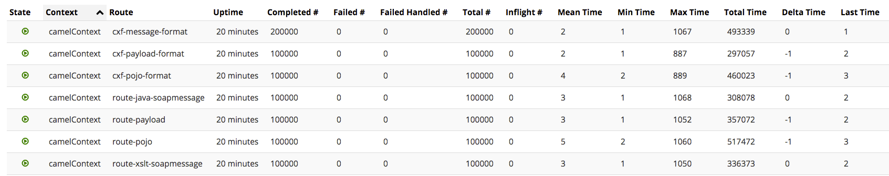

# jms-soap-usecase

Just a number of use cases taking XML from a JMS queue and posting it to a SOAP WebService.

I have the FakeFlexicube.wsdl service in src/main/resources/wsdl/FakeFlexicube.wsdl running locally in SOAPUI as a mockService @ http://localhost:8088/mockFakeFlexicubeSOAP

### CXF Client - 3 ways

- POJO
- PAYLOAD
- MESSAGE

### Add Validation

To make this a true "VETRO" pattern...  Validate | Enrich | Transform | Route | Operate

The XML input can be of anyType, and there is no validation, each route *should* have a validation element in it like `.to("validator:create-transaction-schema.xsd")`

```$java
    from("ems:queue:queue.queuename").routeId("route-xslt-soapmessage")
            .to("direct:delayer")
            .choice()
                .when(xpath("local-name(/*) = 'FCUBS_REQ_ENV'")).to("xslt:xslt/xml-to-soap.xsl")
                    .setHeader("operationName", constant("CreateTransaction")).to("direct:callSOAP-message")
                    .to("validator:create-transaction-schema.xsd")  //HERE IS THE ADDITION
                .endChoice()
                .otherwise().throwException(new ValidationException(null, "unable to validate schema")).endChoice();
```
 
 
#### Speed from total time (just for cxf stuff):

- cxf-message-format = 49339/2 = 246669.5
- cxf-payload-format           = 297057
- cxf-pojo-format              = 460023


#### Speed from Camel -> cxf component

- route-java-soapmessage = 308078
- route-xslt-soapmessage = 336373
- route-payload          = 357072
- route-pojo             = 517472





#### Note

You'll need tibco-jms libs, since this was talking to a Tibco. :)